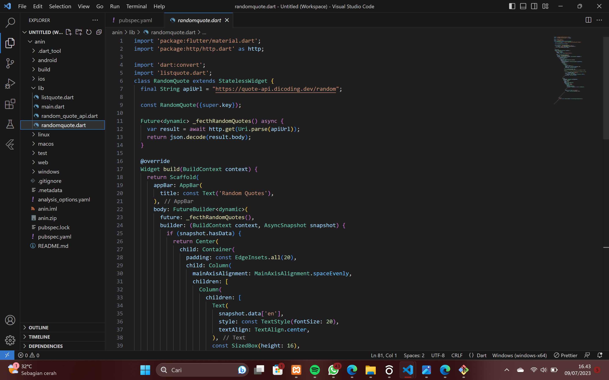
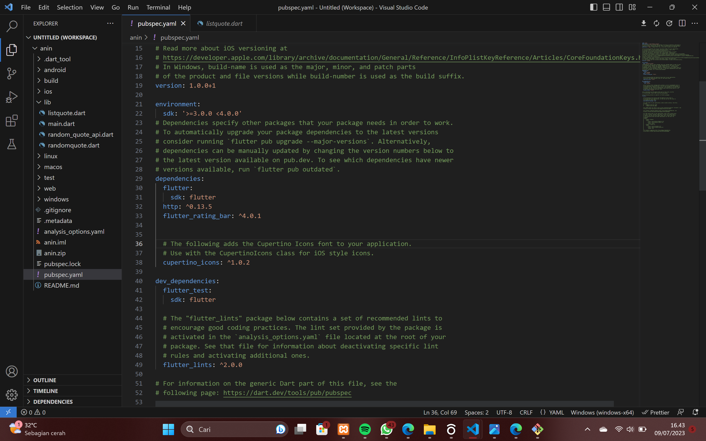
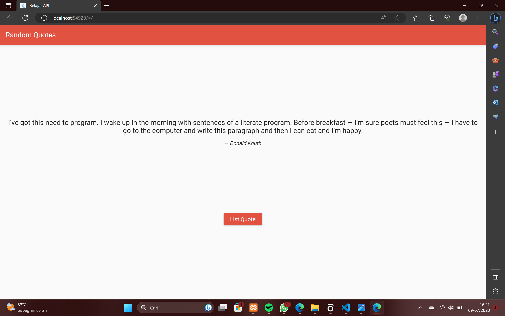
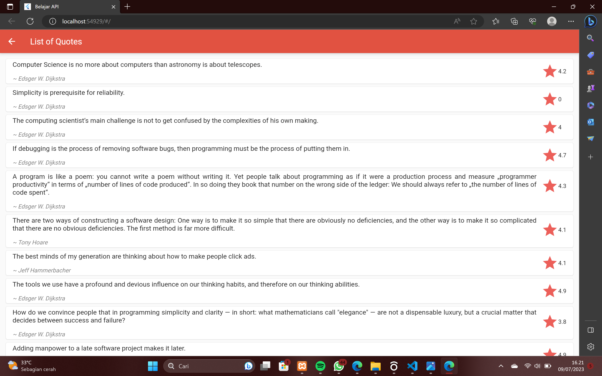

# API

## Profil
| #               | Biodata              |
| --------------- | -----------------    |
| **Nama**        | Anindia Sasikirana   |
| **NIM**         | 312110268            |
| **Kelas**       | TI.21.A.2            |
| **Mata Kuliah** | Pemrograman Web 2    |

## 1. Mengimpor paket http:
Pertama, mengimpor paket http

```
import 'package:http/http.dart' as http;
```
## 2. Membuat kelas RandomQuote:
membuat kelas RandomQuote yang mewarisi dari StatelessWidget. Kelas ini akan digunakan untuk menampilkan kutipan acak dari API ke layar aplikasi.\menambahkan konstruktor dengan menggunakan const pada baris ini

```
const RandomQuote({Key? key});
```

## 3. Membuat URL API:
Anda telah mendefinisikan variabel apiUrl yang berisi URL API yang akan digunakan untuk mengambil kutipan acak. Pastikan URL tersebut valid dan mengarah ke endpoint yang benar

## 4. Mengambil data dari API:
membuat metode _fetchRandomQuotes yang menggunakan paket http untuk mengambil data dari API. Metode ini mengirim permintaan HTTP GET ke URL API dan mengembalikan hasilnya dalam bentuk JSON.

```
Future<dynamic> _fetchRandomQuotes() async {
  var result = await http.get(Uri.parse(apiUrl));
  return json.decode(result.body);
}
```

## 5. Membangun tampilan dengan FutureBuilder:
Di dalam metode build, enggunakan FutureBuilder untuk membangun tampilan berdasarkan status permintaan ke API. FutureBuilder memungkinkan  untuk membangun UI berdasarkan hasil yang akan datang dari permintaan asinkron.
Jika snapshot memiliki data (snapshot.hasData), maka membangun tampilan yang menampilkan kutipan dan penulisnya. Jika snapshot belum memiliki data, menampilkan indikator progres (CircularProgressIndicator).

## 6. Menavigasi ke layar ListQuote:
Ketika tombol "List Quote" ditekan, menavigasi pengguna ke layar ListQuote menggunakan Navigator.push. Pastikan telah mengimpor listquote.dart dengan benar.

## 7. Menggunakan kelas RandomQuote:
Terakhir, dapat menggunakan kelas RandomQuote di dalam aplikasi Flutter, misalnya dalam metode build dari MyApp.

```
void main() {
  runApp(MyApp());
}

class MyApp extends StatelessWidget {
  @override
  Widget build(BuildContext context) {
    return MaterialApp(
      title: 'My App',
      home: RandomQuote(),
    );
  }
}
```



## 8. Pastikan bahwa baris-baris yang dimulai dengan name dan description telah diisi dengan informasi yang sesuai dengan proyek. 

```
name: my_flutter_project
description: A new Flutter project.
```
## 9. Tambahkan baris berikut di bawah dependencies:

```
http: ^0.13.5
flutter_rating_bar: ^4.0.1
```



## HASIL 



